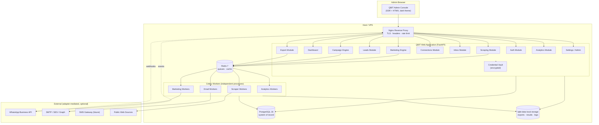
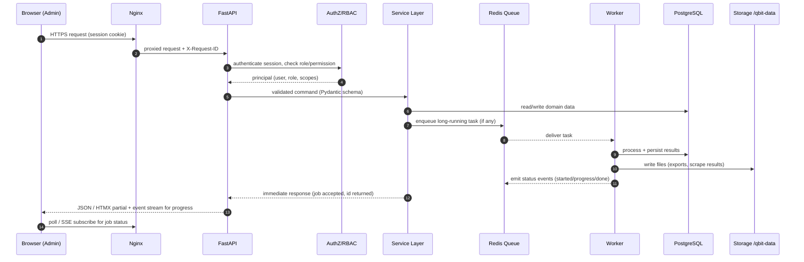

# 02 — System Architecture

> Covers required architecture doc: **System Architecture** · Diagrams: **A (Overall
> System)**, **B (Request Flow)**

## 1. Architectural Principles

1. **Modular monolith first.** One deployable FastAPI application with strictly
   bounded internal modules, plus separate worker processes. This gives microservice-
   style isolation of concerns (scraping ≠ marketing ≠ inbox) without the operational
   cost of a distributed system on a single VPS. Any module can later be extracted
   because boundaries are enforced at the code level.
2. **Queue-mediated async.** Nothing long-running ever runs inside an HTTP request.
   Scraping, campaign dispatch, export generation, and analytics rollups are all jobs
   on Redis-backed queues executed by Celery workers.
3. **Adapter-first integrations.** Every external system (a website being scraped,
   WhatsApp BSP, SMTP/SES, SMS gateway, storage backend) sits behind a versioned
   adapter interface. Adding or replacing a provider never touches core logic.
4. **Self-hosted, low-cost, no lock-in.** PostgreSQL + Redis + local disk. No cloud
   service is required; optional connectors (e.g. Google Drive export) are plugins.
5. **Event-driven traceability.** Every meaningful operation emits a structured event
   with a correlation chain (request_id → job_id → lead_id → message_id), giving full
   observability and analytics without polluting business tables.
6. **Security by construction.** AuthN/AuthZ at the edge of every module, encrypted
   credential vault, secrets server-side only, append-only audit logs.

## 2. Technology Stack (Recommended)

| Layer | Technology | Why |
|---|---|---|
| Backend | Python 3.12 + FastAPI + Pydantic v2 | Async, typed, fast, first-class OpenAPI |
| ORM / Migrations | SQLAlchemy 2.0 (async) + Alembic | Forward-only reviewed migrations |
| Database | PostgreSQL 16 | Concurrency, JSONB, window fns, partitioning |
| Queue / Workers | Redis 7 + Celery (RQ-compatible swap) | Mature retries, scheduling, routing |
| Scraping | httpx, BeautifulSoup4/lxml, Scrapy, Playwright | Right tool per target; policy-aware |
| AuthN/AuthZ | Argon2id + server-side sessions + RBAC middleware | Production-grade admin auth |
| Frontend | Jinja2 SSR + HTMX + Alpine.js + Tailwind CSS | Pure HTML/CSS/JS, zero Node toolchain |
| Reverse proxy | Nginx | TLS, headers, rate limiting, static files |
| Observability | structlog (JSON), health endpoints, optional Prometheus | Traceable, self-hosted |
| Packaging | Docker Compose | One-command self-hosted deploy |

> Frontend note: the brief forbids introducing Node.js without architectural reason.
> SSR + HTMX delivers an Apify-style dense admin console with plain HTML/CSS/JS, no
> SPA build server, and no Node runtime. The backend is API-first (`/api/v1/...`),
> so a JS SPA can be added later without backend rework if ever justified.

## 3. Diagram A — Overall System

## 4. Diagram B — Request Flow

Key rules visible in the flow:

- The HTTP path is **short**: validate → authorize → persist intent → enqueue → return
  a job id. It never performs scraping, bulk sending, or export generation inline.
- Every request carries a generated `X-Request-ID` that propagates into jobs, events,
  and logs (doc 22).
- Progress reaches the UI through lightweight polling or Server-Sent Events — no
  websocket infrastructure required for v1.

## 5. Component Responsibilities (Summary)

| Component | Responsibility | Doc |
|---|---|---|
| Auth Module | Login, sessions, password policy, audit of auth events | 17, 18 |
| Scraping Module | Scraper registry, input validation, job creation | 08 |
| Job/Queue | Celery topology, states, retries, checkpoints | 09 |
| Leads Module | Normalized lead store, dedup, tagging, lifecycle | 06, 08 |
| Marketing Engine | Channel-agnostic sending pipeline + eligibility | 10 |
| WhatsApp / Email / SMS adapters | Provider integrations behind interfaces | 11, 12 |
| Connections | Account registry, credential vault, health | 13 |
| Inbox | Unified conversations across channels | 14 |
| Campaign Engine | Audience → eligibility → template → dispatch | 15 |
| Event Bus | Domain events, outbox, correlation | 16 |
| Export | CSV/XLSX/JSON generation to local storage | 19 |
| Analytics | Event rollups, dashboard aggregates | 16, 22 |
| Storage Service | Abstracted local/mounted file storage | 07 |
| Security/RBAC | Roles, permissions, audit, hardening | 17, 18 |

## 6. Architectural Decision Records (Summary)

| # | Decision | Rationale |
|---|---|---|
| ADR-1 | Modular monolith + workers (not microservices) | Single-VPS self-hosting cost target |
| ADR-2 | Celery over RQ as default | Native retry/eta/routing; RQ adapter possible |
| ADR-3 | SSR + HTMX over SPA | No Node toolchain, matches brief; API-first kept |
| ADR-4 | Server-side sessions over stateless JWT for admin UI | Instant revocation, smaller attack surface |
| ADR-5 | Event outbox pattern | Reliable event publication after DB commit |
| ADR-6 | Credential vault (Fernet) at rest | Never plaintext secrets in DB or logs |
| ADR-7 | Files on filesystem, metadata in Postgres | Large blobs out of DB; cheap local storage |
| ADR-8 | Append-only audit + events | Compliance and post-incident analysis |
