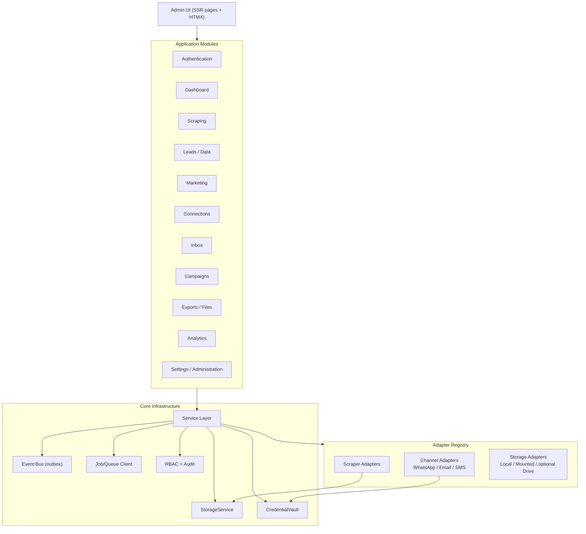

# 03 — Component Architecture

> Covers required architecture doc: **Component Architecture** · Module tree (Final
> Output C) · Scraper plugin architecture summary (Final Output F) · Marketing adapter
> architecture summary (Final Output G)

## 1. Module Map

QBIT is composed of eleven independent modules. Dependencies point strictly downward:
`UI → API → Services → Adapters/Repositories → Infrastructure`. No module may import
another module's internals; cross-module communication happens through service
interfaces and the event bus only.



## 2. Dependency Rules (Enforced)

1. **UI never calls adapters or the DB directly.** It renders server-side views and
   talks to the same FastAPI app.
2. **Modules never import each other.** Scraping doesn't import Leads; it emits
   `LEAD_CREATED`-class events and calls the Leads *service interface* through the
   normalization pipeline boundary.
3. **Adapters never import modules.** They implement interfaces and return DTOs.
4. **Events are the side-channel.** Analytics, inbox attachment, and audit react to
   events; producers stay ignorant of consumers.
5. **No circular imports** — verified in CI with an import-linter contract.

## 3. Backend Module Tree (Final Output D preview; full tree in doc 04)

```
qbit-backend/
├── app/
│   ├── main.py                  # FastAPI factory, middleware, router mounting
│   ├── core/                    # config, security, events, logging, errors
│   ├── auth/                    # login, sessions, passwords, audit
│   ├── rbac/                    # roles, permissions, decorators
│   ├── dashboard/               # aggregate read models
│   ├── scrapers/
│   │   ├── registry/            # plugin discovery + interface
│   │   └── plugins/             # one package per scraper (doc 08)
│   ├── jobs/                    # job manager, states, checkpoints
│   ├── leads/                   # normalized leads, dedup, tags
│   ├── marketing/               # channel-agnostic engine
│   │   ├── eligibility/         # compliance/eligibility service
│   │   ├── templates/           # central template engine
│   │   └── channels/            # whatsapp/ email/ sms/ adapters
│   ├── connections/             # accounts, vault integration, health
│   ├── inbox/                   # conversations, normalizer, assignment
│   ├── campaigns/               # campaign engine + dispatch
│   ├── exports/                 # export manager (CSV/XLSX/JSON)
│   ├── analytics/               # event rollups, aggregates
│   ├── storage/                 # StorageService + adapters
│   └── events/                  # event envelope, outbox, catalog
├── workers/                     # Celery app, task routing, beat schedule
├── migrations/                  # Alembic
└── tests/                       # unit, integration, e2e per module
```

## 4. Frontend Module Tree (summary; details doc 05)

```
qbit-frontend/            # served by FastAPI (Jinja2) — no build server
├── templates/
│   ├── layouts/          # admin shell (sidebar, topbar)
│   ├── views/            # one folder per module
│   └── partials/         # HTMX fragments (tables, cards, modals)
└── static/
    ├── css/qbit.css      # Tailwind build (precompiled once)
    ├── js/htmx.min.js    # vendored, no CDN dependency
    ├── js/alpine.min.js
    └── js/qbit.js        # SSE progress, toasts, confirmations
```

## 5. Scraper Plugin Architecture (Final Output F)

Every scraper is a self-contained plugin package discovered by the registry at startup
(and hot-registrable via the admin UI metadata table):

```
scrapers/plugins/google_maps/
├── manifest.py        # id, name, version, description, category
├── schemas.py         # input_schema, output_schema (Pydantic)
├── scraper.py         # class GoogleMapsScraper(BaseScraper)
└── tests/
```

Common interface every plugin implements (per brief §5):

| Member | Purpose |
|---|---|
| `id` / `name` / `version` / `description` / `category` | Identity metadata |
| `input_schema` / `output_schema` | Typed contract, drives the UI form |
| `validate_input()` | Pre-run validation, returns field errors |
| `run(ctx)` | Executes the scrape with policy-aware pacing |
| `pause()` / `resume()` / `stop()` | Cooperative control via job signals |
| `health_check()` | Liveness for admin diagnostics |

Plugin rules: no shared mutable state, no direct DB writes (results go through the
normalization pipeline), no network without rate/concurrency configuration, and no
evasion of any platform protection (doc 08).

## 6. Marketing Adapter Architecture (Final Output G)

```
MarketingEngine (channel-agnostic)
        │  depends only on this interface
        ▼
ChannelAdapter (abstract)
├── whatsapp/WhatsAppAdapter        → WhatsAppBusinessProvider (official API)
├── email/EmailAdapter              → SmtpProvider · SesProvider · GraphProvider
└── sms/SmsAdapter (future-ready)   → GenericHttpSmsProvider
```

Each channel adapter implements: `send(message)`, `verify_connection()`,
`fetch_delivery_events()`, `handle_webhook(payload)`, `capabilities()`. The engine
orchestrates eligibility → template → sender selection → queue → adapter → provider →
delivery events, and remains identical regardless of which channels are installed
(doc 10).

## 7. Extensibility Contract (Brief §35)

Adding any of the following requires **no core rewrite**:

| Extension | Mechanism |
|---|---|
| New scraper | Drop-in plugin package + registry entry |
| New marketing channel | New `ChannelAdapter` implementation + registry |
| New email/WhatsApp provider | New provider class behind existing adapter |
| New SMS gateway | `SmsAdapter` implementation |
| New export format | New `ExportRenderer` (CSV/XLSX/JSON ship in v1) |
| New storage backend | New `StorageBackend` implementation |
| New analytics integration | Event consumer subscription |
