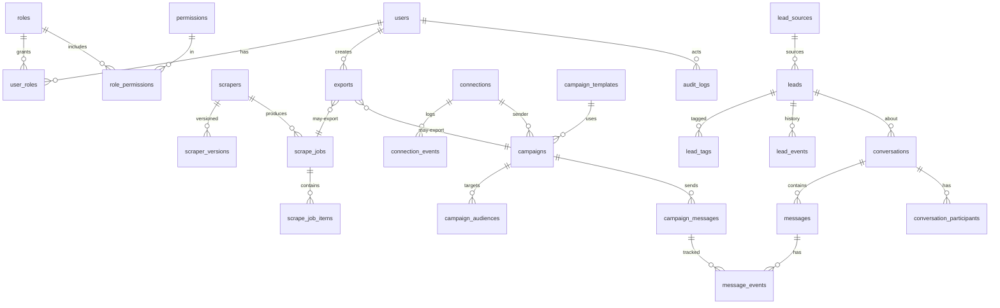
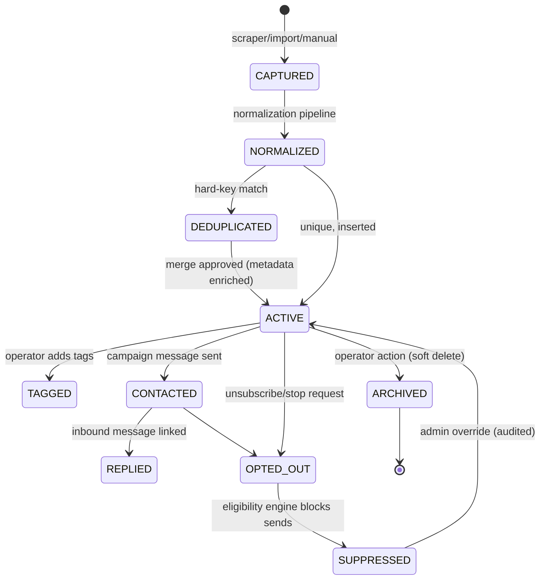

# 06 — Database Architecture (ERD & Table Design)

> Covers required architecture doc: **Database Architecture** · Diagram: **F (Lead
> Lifecycle)** · ERD + table proposal with justification (Brief §38)

## 1. Decisions

- **Production: PostgreSQL 16.** Required for concurrency (many scrape jobs + campaigns
  writing simultaneously), JSONB for source-specific metadata, window functions for
  dedup analytics, and native table partitioning for message/event volume.
- **Development: SQLite permitted** via a SQLAlchemy URL swap for laptop dev/tests, but
  the application is *designed for* Postgres (no SQLite-only shortcuts).
- **ORM:** SQLAlchemy 2.0 async + Alembic migrations. Forward-only, reviewed, never
  auto-drop. No giant tables: core `leads` + source-specific JSONB `metadata`; high-
  volume delivery/event rows partitioned by month.
- **Files are not blobs.** Generated CSV/XLSX/JSON live on the filesystem (doc 07);
  the DB stores metadata rows only.

## 2. ERD (Diagram + Final Output H)

## 3. Table Proposal & Justification (every table justified — Brief §38)

### Identity & access

| Table | Why it exists |
|---|---|
| `users` | Admin operators of the portal. Email, password_hash (argon2id), status, TOTP-ready fields. |
| `roles` | FIXED five roles (SUPER_ADMIN, ADMIN, MANAGER, OPERATOR, VIEWER). Seeded, not free-form — keeps RBAC auditable. |
| `permissions` | Atomic verbs (`job.cancel`, `campaign.start`, …) so role→permission mapping is explicit. |
| `user_roles` | M:N users↔roles; supports future multi-role without schema change. |
| `role_permissions` | The RBAC matrix itself (doc 18); changes audited. |

### Scraping

| Table | Why it exists |
|---|---|
| `scrapers` | Registry of installed plugins (id, name, category, status) — powers the catalog UI without code introspection at runtime. |
| `scraper_versions` | Immutable version rows (semver, schemas snapshot). Jobs pin a version so historical runs are reproducible and schema drift never corrupts old results. |
| `scrape_jobs` | One row per run: input JSONB, pinned version, state (QUEUED…CANCELLED), counts (found/saved/duplicates/errors), checkpoints JSONB, timing, error. The backbone of the job system. |
| `scrape_job_items` | Per-item results/row counts + sample references. Enables per-item retry and accurate dedup stats without inflating `leads`. |

### Leads

| Table | Why it exists |
|---|---|
| `leads` | The normalized core record (brief §9): business_name, contact_name, phone, email, website, address, city, state, country, category, source, source_url, social_links JSONB, metadata JSONB, consent/opt-out flags, timestamps. Source-specific extras live in `metadata`, NOT columns — avoids a giant table. |
| `lead_sources` | Origin catalog (scraper, manual import, API) with unique source identifiers — enables provenance and per-source dedup rules. |
| `lead_tags` | Free/user-defined labels (M:N via join table `leads.lead_tags` rows or join table) for audience building. |
| `lead_events` | Append-only lifecycle history (created, updated, deduplicated, merged, suppressed, contacted). Powers the lead timeline and audit without touching core rows. |

### Marketing

| Table | Why it exists |
|---|---|
| `campaigns` | Channel, name, status (DRAFT…CANCELLED), schedule, sender connection, counters, config JSONB (rate limits, windows). Channel-agnostic core. |
| `campaign_audiences` | Materialized recipient list per campaign with per-recipient eligibility verdict + reason — the eligibility engine writes here, making every skip explainable. |
| `campaign_templates` | FK to central templates: versioned snapshot used by the campaign (template content is versioned so edits never mutate a running campaign). |
| `campaign_messages` | One row per intended send (message_id idempotency key, state, provider ids). High volume → monthly partitions. |

### Connections & messaging

| Table | Why it exists |
|---|---|
| `connections` | Connected accounts (WhatsApp/Email/SMS/storage): provider, display name, identifier, status, health, capabilities JSONB, encrypted secret reference (never plaintext). |
| `connection_events` | Lifecycle log: connect/test/disconnect/error/token-refresh. Debugging + audit. |
| `conversations` | Unified inbox threads: channel, lead FK, subject, state (open/closed), assignment. |
| `conversation_participants` | Who is on a thread (agent(s), system) — supports assignment + future multi-agent. |
| `messages` | Inbound + outbound message rows (direction, body, provider ids, timestamps). Partitioned. |
| `message_events` | Delivery lifecycle events (queued/sent/delivered/read/failed/bounced/replied) with dedup keys — analytics source of truth. |

### System

| Table | Why it exists |
|---|---|
| `exports` | Export metadata: filename, format, source (job/campaign), record_count, size, path, created_by, status — the file browser's backing store. |
| `files` | Generic registry of any stored file (imports, attachments, scrape attachments) with checksum + path — keeps DB small while making storage auditable and searchable. |
| `audit_logs` | Append-only who/what/when/before/after for every privileged action (Brief §23). |
| `system_settings` | Admin-editable runtime config (rate caps, retention, feature flags) — avoids redeploying for ops tweaks. |
| `events_outbox` | Transactional outbox: domain events committed with business data, relayed to consumers (doc 16). |
| `event_log` | Durable event stream (typed catalog from Brief §22) for analytics and traceability. |

**Deliberately avoided:** per-scraper wide tables, message bodies inside campaigns,
blobs in DB, free-form role explosion, EAV columns.

## 4. Deduplication Strategy (Brief §9)

Deduplication is **configurable per source** and evaluated at ingestion:

1. **Hard keys (unique indexes, case/whitespace-normalized):** `phone` (E.164),
   `email` (lowercase), `website` (host-normalized), and `(source, source_id)`.
2. **Fuzzy keys (candidate match, human-confirmed merge):** normalized business name +
   city via trigram index (`pg_trgm`).
3. New scraper rows that match an existing lead update `metadata`/`last_seen` and
   increment the job's duplicate counter instead of inserting.

## 5. Indexing & Volume Strategy

| Table | Key indexes |
|---|---|
| `leads` | unique(phone), unique(email), unique(website), GIN(metadata), GIN trigram(business_name), (city), (country), (created_at) |
| `scrape_jobs` | (status), (created_at), (scraper_id, created_at) |
| `campaign_messages` / `messages` / `message_events` | PK (id, month) monthly partitions; (campaign_id), (conversation_id), (occurred_at), unique dedup key |
| `audit_logs` / `event_log` | (occurred_at BRIN), (actor_id), (type) |

Scaling path to 1M+ leads is detailed in doc 23 (partitioning, BRIN, batch ingestion).

## 6. Diagram F — Lead Lifecycle

Every transition emits a `lead_events` row and a domain event (doc 16) — the timeline
on `/leads/:id` is a direct projection of this lifecycle.
