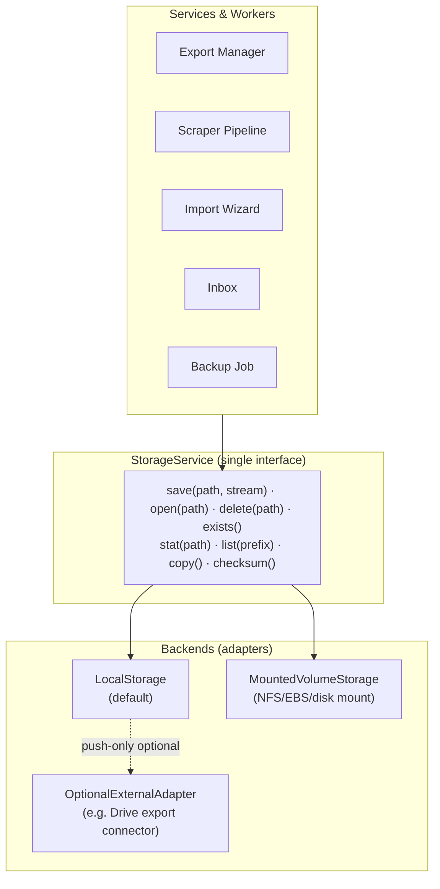
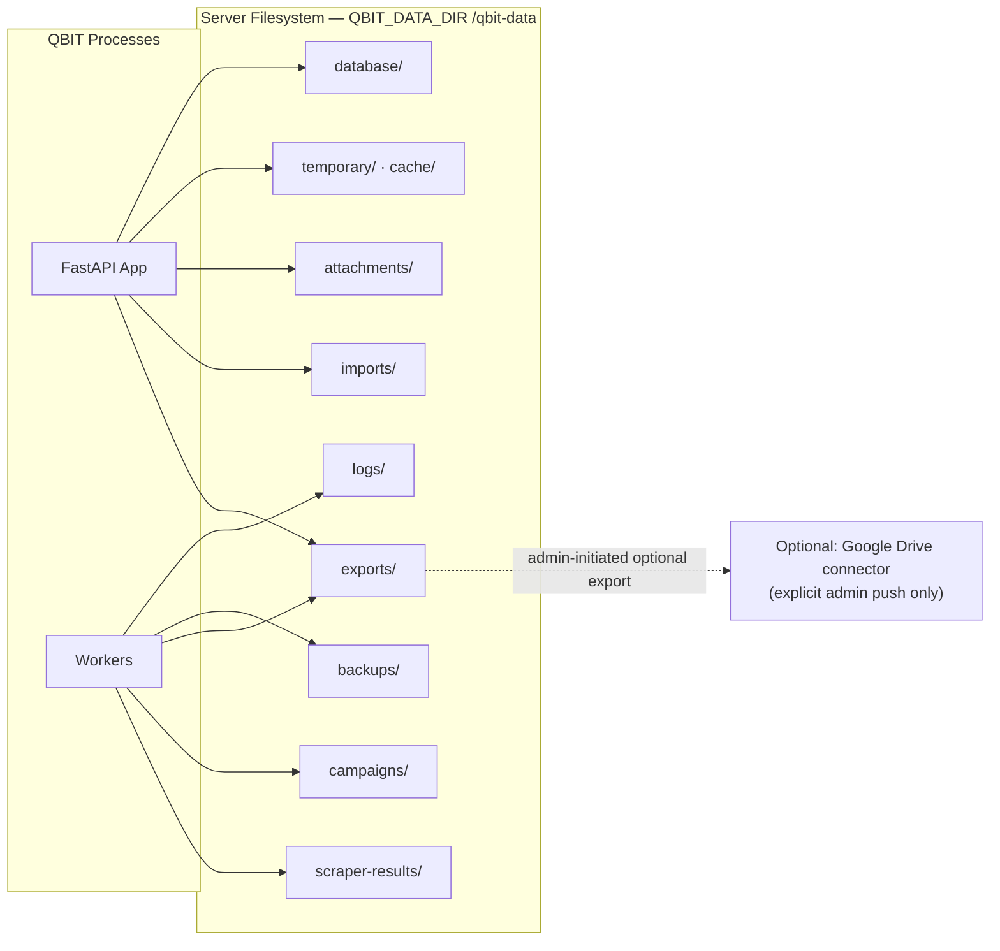

# 07 — Storage Architecture

> Covers required architecture doc: **Storage Architecture** · Diagram: **J (Storage
> Architecture)** (Brief §10, §25)

## 1. Decision: Self-Hosted Local/Mounted Storage Is Primary

QBIT **must be self-hosted**; cloud storage is never mandatory. The primary persistent
store is the server's local or mounted filesystem at a configurable data root
(`QBIT_DATA_DIR`, default `/qbit-data`). Google Drive or any external provider can
only ever appear as an *optional export connector* — never the system of record.

## 2. Directory Layout

```
/qbit-data/                    # QBIT_DATA_DIR (mount point in Docker)
├── database/                  # (dev-only SQLite if used; prod DB runs in its own volume)
├── exports/                   # generated CSV / XLSX / JSON downloads
│   └── 2026/09/…              # sharded by year/month to avoid huge dirs
├── imports/                   # uploaded import files (staged, then archived)
├── scraper-results/           # raw page artefacts & per-job result snapshots
│   └── {job_id}/…
├── campaigns/                 # campaign artefacts (rendered previews, reports)
├── attachments/               # inbox message attachments
├── logs/                      # rotating application/worker logs
├── backups/                   # DB dumps + config backups (doc 21)
├── temporary/                 # in-progress downloads/renders (auto-clean of own files)
└── cache/                     # disposable caches (safe to wipe)
```

Every path is derived from `QBIT_DATA_DIR` — relocating storage is a config change,
not a code change.

## 3. StorageService Abstraction



Contract rules:

- Services never touch `open()`/`Path` directly for QBIT-managed files — always the
  `StorageService`, so backends are swappable and access control is centralized.
- Every saved file gets a `files` metadata row (path, size, sha256, source, created_by)
  enabling search, quota checks, and integrity verification.
- `delete()` is permissioned and audited; **automatic deletion of user data is
  forbidden** — only retention jobs for `temporary/` and `cache/` may auto-clean, and
  only their own contents.

## 4. File Lifecycle

| Stage | Behavior |
|---|---|
| Create | Written to `temporary/` → checksummed → atomically moved to final shard → `files` row committed in same transaction as referencing record |
| Read | Authorized streaming endpoint (`/api/v1/exports/:id/download`), content-type enforced, never a browsable static dir |
| Update | Immutable: new version path, old row superseded (no in-place mutation) |
| Delete | Soft-delete flag + audited; physical purge only via explicit admin retention action |
| Verify | Nightly checksum spot-check job; mismatches surfaced in `/settings/storage` |

## 5. Capacity & Health

- `GET /api/v1/dashboard/health` reports: free space, usage %, inode pressure, and
  per-directory sizes for `/settings/storage`.
- Configurable warning (default 80%) and critical (90%) thresholds raise system-health
  events; when critical, new exports/imports are refused with a clear operator message
  while scraping results that persist to DB keep working (doc 23, "Storage full").
- Quotas: max upload size (`QBIT_MAX_UPLOAD_MB`), max single export rows/size guard.

## 6. Diagram J — Storage Architecture



**Rules recap:** DB stores metadata, filesystem stores bytes; no cloud dependency;
every file is registered, checksummed, permissioned, and auditable; nothing user-owned
is ever deleted automatically.
