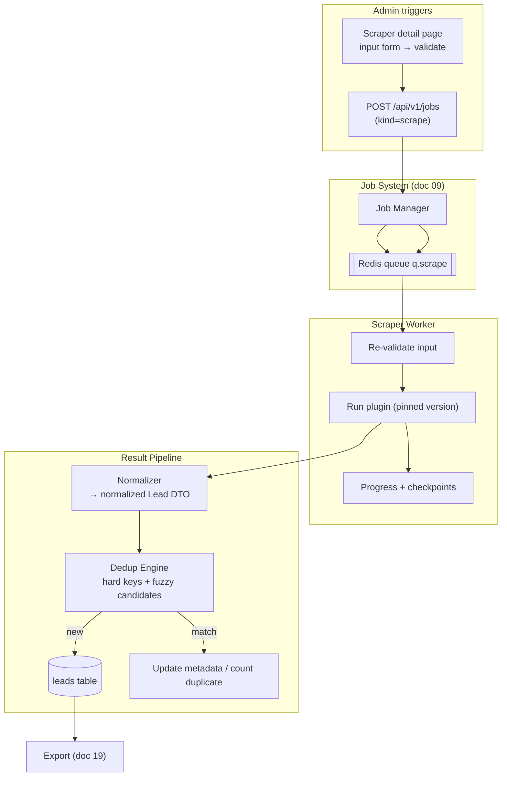
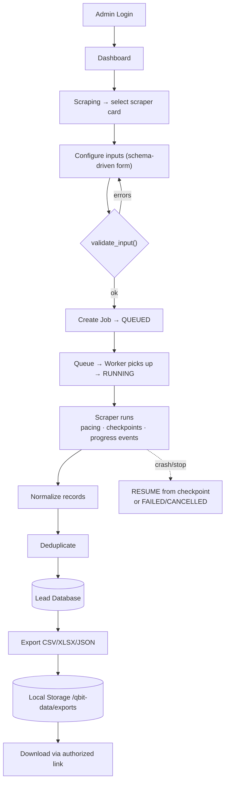

# 08 — Scraper Architecture (Plugin System)

> Covers required architecture doc: **Scraper Architecture** · Diagram: **C (Scraping
> Flow)** · Scraper plugin architecture (Final Output F) · Compliance rules (Brief §8)

## 1. Design Goal

Scraping is a **first-class subsystem**, not a script collection: a registry of
independent plugin modules sharing one contract, one job pipeline, one normalization
layer. New scrapers are installed without rewriting anything (Brief §5, §35).

## 2. Plugin Contract

Every scraper is an independent module implementing the common interface:

| Member | Type | Purpose |
|---|---|---|
| `id` | str | Stable slug (`google_maps`, `website`, `email_finder`, …) |
| `name` | str | Display name |
| `version` | semver | Pinned into every job for reproducibility |
| `description` | str | Card + detail page copy |
| `category` | enum | maps / website / directory / government / social / ecommerce / universal |
| `input_schema` | Pydantic | Drives the auto-generated input form + validation |
| `output_schema` | Pydantic | Contract of emitted records |
| `validate_input()` | fn | Pre-run field validation with human-readable errors |
| `run(ctx)` | fn | Executes with `ctx` providing pacing, storage, progress, signals |
| `pause()` / `resume()` / `stop()` | fn | Cooperative control via job signals |
| `health_check()` | fn | Diagnostic ping used by Connections-style status cards |

Hard rules for plugins:

- No direct DB access — records are yielded to the pipeline; the platform persists.
- No shared mutable state between jobs; all state is in `ctx` or checkpoints.
- All network I/O through the shared policy client (rate, concurrency, timeout,
  retry/backoff, UA policy) — never raw requests with evasion tricks.
- Results must be deterministic on retry (checkpointed cursor).

## 3. Initial Plugin Catalog

Google Maps Scraper · Website Scraper · Business Directory Scraper · Public Government
Data Scraper · Email Finder · Phone/Contact Extractor · LinkedIn Public Data Adapter ·
Instagram Public Data Adapter · Facebook Public Data Adapter · Amazon Public Data
Adapter · IndiaMART-type Directory Adapter · Justdial-type Directory Adapter ·
Universal Web Scraper.

Adapters for branded platforms operate **only on public/authorized data via supported
access**, and degrade gracefully (return zero + informative status) when a source
declines automated access — they never attempt bypass.

## 4. Compliance Gate (Brief §8 — hard requirements)

The shared policy client enforces, per source:

- Respectful request rates + configurable concurrency (per-domain budget).
- Retries with exponential backoff + jitter; hard timeouts.
- robots/policy-aware behavior where applicable; source-specific restrictions in
  plugin manifests (allowed paths, disabled features).
- Appropriate User-Agent configuration; honoring errors-as-signals (429/403 → backoff
  or abort, never circumvention).
- **Forbidden by design** (never implemented, CI guard on imports/flags): CAPTCHA
  bypass, login/paywall bypass, anti-bot evasion, stealth fingerprinting, rate-limit
  evasion, private-profile extraction, credential theft, ban evasion.

## 5. Pipeline: Scrape → Normalize → Dedup → Lead

Normalization (Brief §9) maps every plugin's output to the canonical Lead
(business_name, contact_name, phone, email, website, address, city/state/country,
category, source, source_url, social_links, metadata). Phone → E.164, email lowercased,
website host-normalized, whitespace/title-case rules applied. Source-specific fields
land in `metadata` JSONB — never new columns.

## 6. Diagram C — Scraping Flow (End-to-End, Brief §28 Flow A)

## 7. Failure & Safety Semantics

| Concern | Mechanism |
|---|---|
| Crash mid-run | Checkpoint (cursor/page/offset) persisted every N items; job resumes from checkpoint (doc 09) |
| Hang | Hard timeout per task + per job; worker heartbeat (doc 23) |
| Poison input | Validation rejected pre-queue; schema errors surfaced to operator |
| Duplicate flood | Dedup counters per job; per-source caps |
| Silent partial results | Job records found/saved/duplicates/errors; UI shows exact accounting |
| Lawful-access change | Source plugin returns clear `SOURCE_UNAVAILABLE` status, never evasion |
