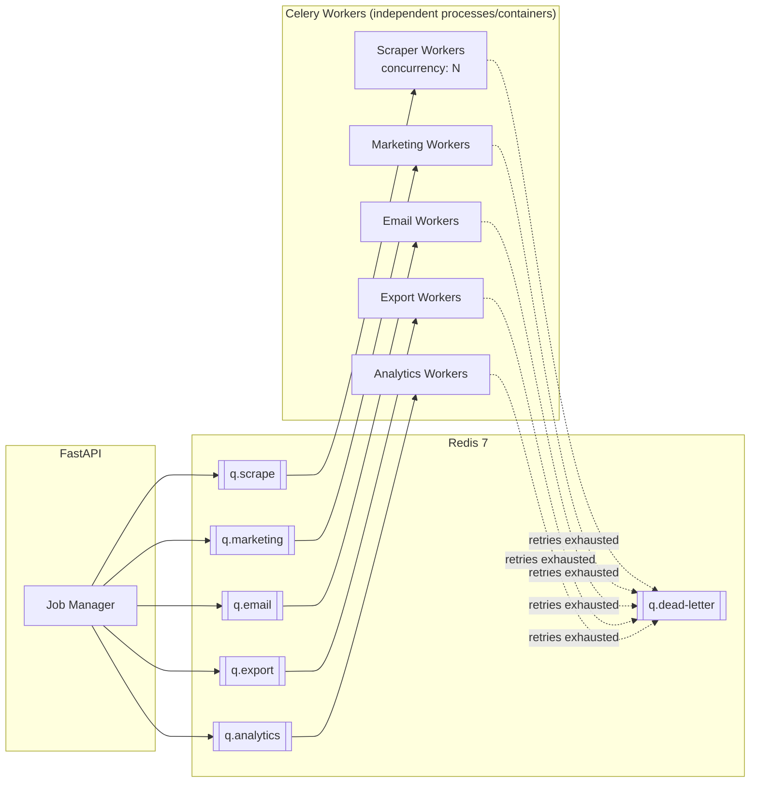
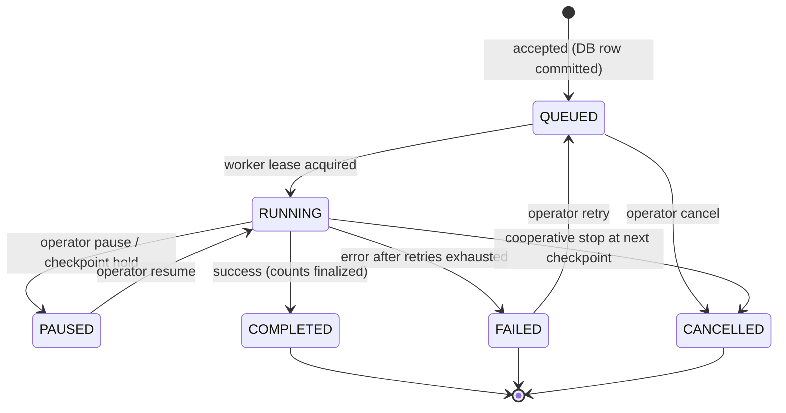
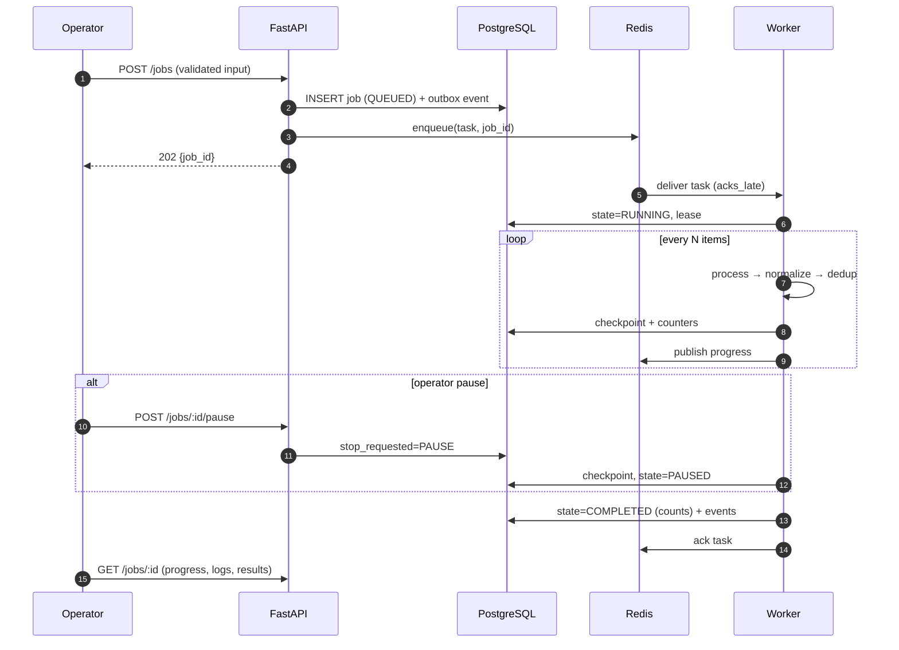

# 09 — Job / Queue Architecture

> Covers required architecture doc: **Job/Queue Architecture** · Diagram: **G (Job
> Lifecycle)** (Brief §7)

## 1. Topology

- **Queues are routed by concern** so a slow 50k-row export can never starve campaign
  dispatch, and scraping bursts never block exports.
- Workers are independent processes (independently scalable — Brief §27): scale
  scraper workers horizontally without touching marketing workers.
- Redis doubles as broker + result backend + progress pub/sub (SSE relay).
- Redis unavailability is survivable: jobs are created in Postgres first (state
  QUEUED, `enqueued_at`), a recovery job re-enqueues orphans on broker reconnect
  (doc 23 "Redis unavailable").

## 2. Job States (Brief §7)

State is stored in Postgres (`scrape_jobs` / campaign/export tables) — Redis holds
only ephemeral queue/lease data. Every transition emits an event (doc 16) and writes
job history.

## 3. Guaranteed Behaviors

| Requirement | Mechanism |
|---|---|
| Job IDs | ULID primary keys, returned immediately at submission |
| Queuing | Per-concern queues with priorities; fair ordering per source |
| Retry | Exponential backoff + jitter (base 5 s, max 5 attempts, config per task kind); retries are idempotent (checkpoint + dedup keys) |
| Timeout | Soft timeout (task can checkpoint & exit) + hard timeout (kill); both per task kind |
| Cancellation | Cooperative: worker checks `stop_requested` flag at safe points; HTTP-cancel marks flag, force-kill only after grace period |
| Pause/resume | Checkpoint cursor persisted every N items → resume continues from checkpoint; supported where technically possible (Brief §7) |
| Resume after crash | Worker heartbeat lease; expired lease → job back to QUEUED with `resumed_count++` |
| Error logging | Exception → structured log + `job.error` + event `*_FAILED` with request/job correlation |
| Progress tracking | `update_progress(done, total)` → Redis pub/sub → SSE/poll in UI; counts also committed to DB every 10% |
| Result counts | found / saved / duplicates / errors finalized on completion |
| Deduplication | Dedup at ingestion (doc 06 §4); retries never double-insert |
| Job history | Immutable `job history` rows + filters on `/scraping/jobs` |

## 4. Long-Running Work Discipline (Brief rule 24–25)

- **No scraping, bulk sending, or export generation inside HTTP requests. Ever.**
  The HTTP path only validates, persists intent, enqueues, and returns a job id.
- Task wrappers are thin; all logic lives in services so HTTP and worker paths share
  one implementation.
- Every task declares: queue, `acks_late=True`, `reject_on_worker_lost`, `time_limit`,
  `soft_time_limit`, `max_retries`, and an idempotency key.

## 5. Diagram G — Job Lifecycle (system view)

## 6. Dead-Letter & Recovery

Tasks failing after max retries land in `q.dead-letter` with the full context; the
admin UI (`/scraping/jobs?status=failed`, plus a dead-letter panel in
`/settings/system`) allows inspection and safe requeue. A periodic beat task
reconciles DB-QUEUED jobs against Redis to repair any broker loss (doc 23).
