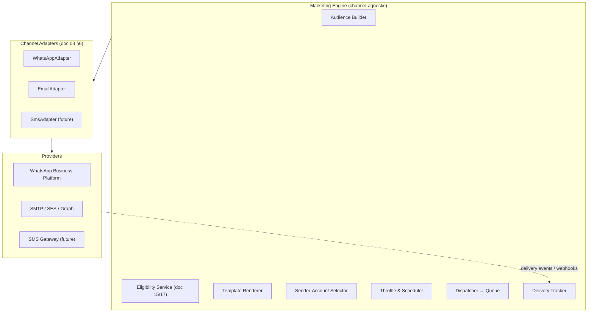

# 10 — Marketing Architecture (Channel-Agnostic Engine)

> Covers required architecture doc: **Marketing Architecture** (Brief §12)

## 1. Principle: The Engine Never Knows the Channel

Marketing spans WhatsApp, Email, and (future) SMS. Campaign logic — audiences,
eligibility, templates, scheduling, throttling, tracking — lives in **one channel-
agnostic Marketing Engine**. Channels are swappable adapters. WhatsApp is never
hard-coded into campaign logic (Brief §12: "extremely important").

## 2. Campaign Concept (channel-independent)

A campaign contains exactly: `campaign_id, name, channel, audience, template,
sender_account (connection), schedule, status, eligibility_rules, tracking, analytics,
audit_trail`. The same fields exist for WhatsApp and Email; only the adapter differs.
This is what makes 1 → 100 sending accounts and new channels a registry change rather
than a rewrite (Brief §14, §35).

## 3. Engine Pipeline (per campaign dispatch)

1. **Audience** — lead segments by tags/category/source or explicit selection; snapshot
   written to `campaign_audiences` at start (immutable per run).
2. **Eligibility** — the central Communication Eligibility Service (doc 15 §2) filters
   every recipient before send; verdict + reason stored per recipient.
3. **Template** — central template engine renders variables
   (`{{first_name}}`, `{{business_name}}`, `{{city}}`, `{{category}}`, `{{website}}`)
   with preview + validation; campaign pins a template version (doc 15 §3).
4. **Sender selection** — operator picks an authorized connected account; the engine
   only checks capability + health (doc 13).
5. **Throttling** — per-account and per-campaign rate caps, sending windows, quiet
   hours; enforced by the dispatcher, not by adapters.
6. **Dispatch** — recipient messages enqueued to the channel queue; each carries a
   globally unique `message_id` (idempotency key) so provider/webhook retries can
   never double-send (Brief §39 "duplicate message event").
7. **Tracking** — provider delivery events (webhook or polling) normalize into
   `message_events` → campaign counters + analytics + inbox linking.

## 4. Cross-Channel Invariants

| Invariant | Rule |
|---|---|
| Consent | No send without passing eligibility; scraped emails/phones are NOT automatic permission (Brief §15) |
| Suppression | Opt-out is global per channel, instant, and irreversible by campaign logic (only admin override, audited) |
| Idempotency | One `message_id` per recipient per campaign; adapters must be safe to retry |
| Auditability | Every dispatch decision (sent/skipped + reason) is a row, not a log line |
| Rate safety | Caps are config, enforced centrally; adapters may add provider-specific backoff but never bypass platform limits |
| Pause/Stop | Campaign pause propagates to queue within one poll interval; in-flight message outcomes still tracked |

## 5. Module Boundaries

- `marketing/engine.py` — pipeline orchestration (no channel imports).
- `marketing/eligibility.py` — shared service (also used for inbox replies).
- `marketing/templates.py` — central template store/renderer/versioning.
- `marketing/channels/<channel>/` — adapter + provider classes only; may not import
  engine internals (dependency arrow points inward only).
- Adding Email or SMS never modifies `engine.py` — a registry entry + adapter package.
