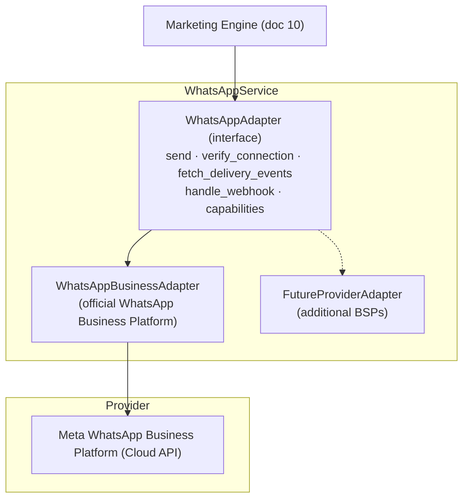
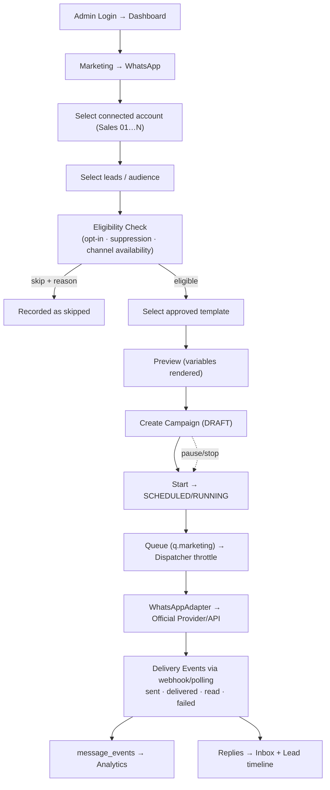

# 11 — WhatsApp Architecture

> Covers required architecture doc: **WhatsApp Architecture** (Brief §13, §14)

## 1. Provider Abstraction

The **primary production implementation uses the official WhatsApp Business Platform**
(supported business APIs). QBIT ships adapters, not evasions.

**Explicitly NOT implemented** (Brief §13 red lines): anti-ban tricks, detection
bypass, randomized stealth automation, CAPTCHA bypass, rate-limit bypass, unauthorized
bulk messaging. Where a source or provider declines, the system records the outcome —
it never works around it.

## 2. What the System Provides Instead

Official account connection · template management (with provider approval states) ·
campaign management · recipient eligibility checks · opt-out/suppression list · rate
controls · delivery status · read status where available · reply events · error events
· webhooks · audit logs · campaign pause/stop · account health/status.

## 3. Multiple Team Accounts (1 → 20 → 50 → 100)

Every WhatsApp number is a **Connection row** (doc 13), not a config constant:

| Field | Meaning |
|---|---|
| `connection_id` | Stable id used by campaigns |
| `display_name` | "Sales 01" … "Sales 20" |
| `phone identifier` | WABA phone number id |
| `provider` | `whatsapp_business_cloud` (future: other BSPs) |
| `status` / `health` | connected / degraded / disconnected + provider quality signal |
| `connected_at` / `last_sync` | Lifecycle timestamps |
| `capabilities` | Templates, media, catalog support |
| `metadata` | WABA ids, tokens held only in the encrypted vault |

A campaign selects a sending account (`sender connection_id`). The engine assumes
**any number of accounts** — account list is data, not schema. Rate caps are enforced
**per account**, so scaling from 1 → 100 accounts means adding connections and
capacity, not code (Brief §14).

Webhook routing: one verified webhook endpoint demultiplexes by phone-number-id →
connection → account; every inbound event is idempotency-checked before processing.

## 4. Template Lifecycle

1. Draft in QBIT (variables validated against lead schema).
2. Submit to provider for approval where required → `approval_state` stored
   (PENDING/APPROVED/REJECTED) with reason.
3. Only APPROVED templates are selectable for campaigns.
4. Campaign pins template **version**; later edits never mutate running campaigns.

## 5. Rate & Compliance Controls

| Control | Default |
|---|---|
| Per-account messages/minute | Configurable cap (conservative default) |
| Sending window / quiet hours | Timezone-aware per campaign |
| Recipient eligibility | Eligibility Service verdict REQUIRED before enqueue (doc 15) |
| Opt-out | `STOP`-style inbound keyword → instant global suppression for the channel, conversation closed, event recorded |
| Quality signals | Provider quality rating surfaced on `/connections/whatsapp`; degraded health blocks new campaigns on that account |

## 6. Diagram D — WhatsApp Campaign Flow (Brief §28 Flow B)

## 7. Failure Semantics (detail in doc 23)

Token expired → connection marked `needs_reauth`, campaigns on that account auto-
paused with operator notification. Webhook duplication → idempotency key on provider
event id. Provider outage → exponential backoff, campaign stays RUNNING with stalled
counter visible; no silent data loss — every intended recipient has a row.
