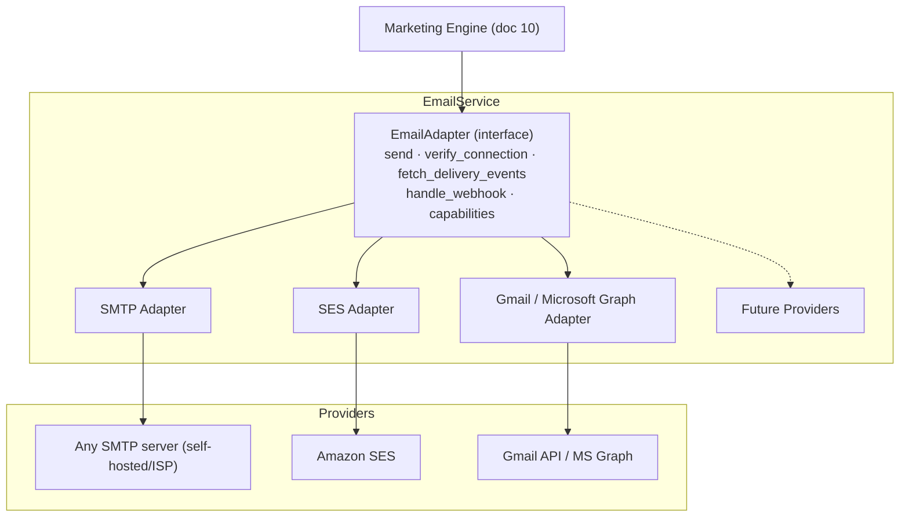
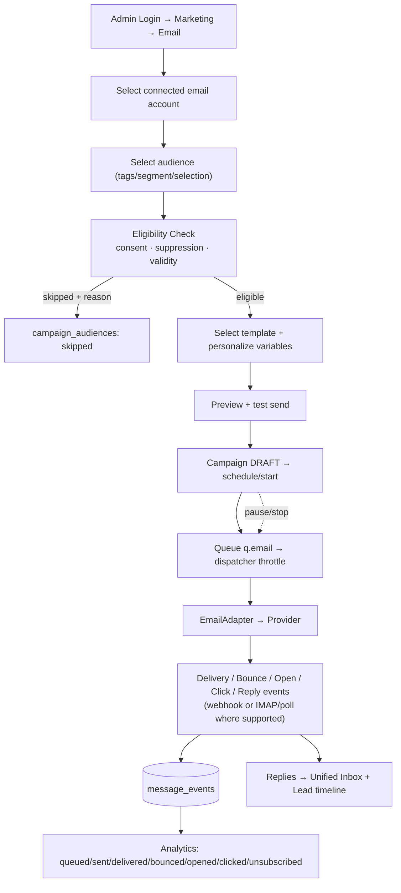

# 12 — Email Architecture

> Covers required architecture doc: **Email Architecture** · Diagram: **E (Email
> Campaign Flow)** (Brief §15, §28 Flow C)

## 1. Provider Abstraction

The default **SMTP Adapter** keeps QBIT fully self-hosted (no SaaS requirement);
provider adapters are optional upgrades when volume demands (Brief §33: external paid
APIs only where unavoidable or explicitly selected by the administrator).

## 2. Feature Set (Brief §15)

Connect email account → verify connection → templates (central engine, variables,
personalization) → audience selection → campaign creation → scheduling → sending
queue → delivery tracking → bounce handling → unsubscribe → suppression list → reply
tracking where supported → analytics → campaign pause/stop.

**Consent rule:** scraped emails are NOT automatic permission to send. Every recipient
passes the Eligibility Service; leads carry `consent_status` and
`marketing_opt_out` fields per channel; suppression is enforced at dispatch time and
at webhook time (an unsubscribe can never be overwritten by a later campaign).

## 3. Bounce & Reputation Handling

| Event | Handling |
|---|---|
| Hard bounce | Address suppressed for email channel; `message_events` row; counter on connection health |
| Soft bounce | Retry with backoff (max 3 within campaign window) → then suppress with reason |
| Complaint/spam report | Immediate suppression + audit event |
| Unsubscribe click | Instant opt-out (channel-global), confirmed page, event to inbox timeline |
| Bounce-rate guard | Connection-level threshold: new campaigns on that account blocked until reviewed |

## 4. Diagram E — Email Campaign Flow

## 5. Sending Mechanics

- Per-message `message_id` idempotency key; provider message ids recorded on the
  event stream (dedup on webhook retries).
- Batch dispatch with per-connection rate caps and warm-up profile; sending windows
  respected; campaign pause drains within one poll interval.
- Tracking (open/click) implemented via self-hosted redirect/pixel endpoints only when
  the admin enables it — documented clearly, respecting provider policies.
- Reply detection: inbound mail to connected mailboxes (Graph/Gmail webhooks or IMAP
  IDLE) → Message Normalizer → Conversation Service → Inbox (doc 14) and linked to
  the lead timeline.
- All credentials live in the encrypted vault (doc 17); API tokens never appear in
  responses or logs.
