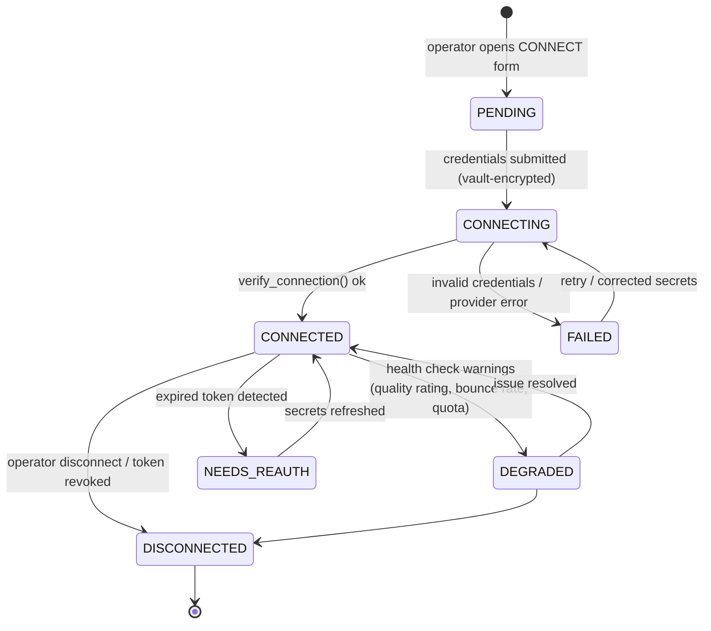

# 13 — Connection Architecture

> Covers required architecture doc: **Connection Architecture** · Diagram: **H
> (Connection Lifecycle)** (Brief §16)

## 1. Connection Center

One central **CONNECTIONS** page manages every external integration by category:
WhatsApp · Email · Future SMS · Future APIs · Storage. Every connection exposes the
same four actions: **CONNECT · TEST · DISCONNECT · STATUS** — a uniform grammar that
keeps onboarding predictable regardless of provider.

## 2. Connection Record

Stored in `connections` (doc 06): `connection_id, category, provider, display_name,
phone/email identifier, status, connected_at, last_sync, capabilities JSONB, health,
metadata`. **Credentials are never stored in plaintext**: secrets are encrypted with
Fernet (AES128-CBC+HMAC) under a master key from the environment (`QBIT_VAULT_KEY`),
and only the ciphertext reference lives in the DB. Token rotation is supported
(update secret → TEST → connection_events row). API tokens are never exposed in any
frontend response (Brief §16, §41).

## 3. Lifecycle & Health

Transitions are written to `connection_events` (append-only) and surfaced in the UI
timeline. Every state change emits domain events (`CONNECTION_CREATED`,
`CONNECTION_CONNECTED`, `CONNECTION_FAILED`, `CONNECTION_DISCONNECTED`, doc 16).

## 4. Health Model

| Signal | Source | Effect |
|---|---|---|
| `TEST` action | On-demand `verify_connection()` | Immediate status display; blocks campaign creation on failure |
| Scheduled probe | Beat task, every 5 min per active connection | Auto `DEGRADED`/`NEEDS_REAUTH` |
| Provider quality | WhatsApp quality rating, email bounce/complaint rates | Threshold → auto-pause campaigns on that account |
| Quota/limit headers | Provider responses | Adaptive throttle within configured caps |

Campaign creation requires a `CONNECTED` (or better) sender account; `DEGRADED`
accounts warn; `FAILED/DISCONNECTED/NEEDS_REAUTH` accounts are not selectable.

## 5. Security Rules

- Secrets entered once, encrypted at rest, decrypted only in worker memory at send
  time; never logged, never serialized to the client, never included in exports.
- All connect/test/disconnect actions are RBAC-guarded (admin) and audited with actor,
  before/after status, and request-id (docs 17, 18).
- Webhook verification secrets per connection (doc 17 §6).
- Disconnect is a soft action: rows and message history are retained (data ownership,
  Brief §42); only the credential ciphertext is destroyed.

## 6. Extensibility

New provider = new adapter class + registry entry (WhatsApp BSP, ESP, SMS gateway,
storage backend). The Connections UI renders it automatically from the provider
registry metadata — no new pages, no schema change (Brief §35).
