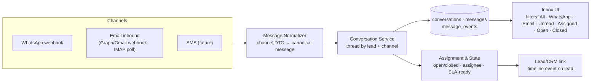

# 14 — Inbox Architecture (Unified Messaging)

> Covers required architecture doc: **Inbox Architecture** (Brief §17)

## 1. Goal

One unified communication layer where every inbound message — WhatsApp reply, email
response, future SMS — becomes a conversation attached to a lead, with assignment,
state, and agent replies. Future channels plug into the same inbox without schema
change.

## 2. Inbound Pipeline

## 3. Normalizer Contract

Every channel adapter converts its inbound payload into the canonical message DTO:
`{ channel, connection_id, external_thread_id, external_message_id, direction,
from, to, body, attachments[], occurred_at, raw_ref }`. Dedup key =
`(provider, external_message_id)` — webhook retries are idempotent (Brief §39).

## 4. Conversation Model

- A conversation is **(lead, channel)** — the same lead replying on WhatsApp and email
  yields two threads, cross-linked on the lead timeline.
- `conversations` carries state (`OPEN`/`CLOSED`), assignment, unread counts, last
  message preview; `messages` holds the immutable content; `message_events` the
  delivery lifecycle for outbound replies.
- Agent replies go through the **same eligibility gate** as campaigns (suppression,
  channel availability) but with relaxed consent rules (replying to an inbound thread
  is transactional context, recorded in the audit trail).
- Attachments are stored via StorageService under `attachments/` with `files` rows.

## 5. UI Behavior (`/inbox`)

| Element | Behavior |
|---|---|
| Filter tabs | All / WhatsApp / Email / Unread / Assigned / Open / Closed (server-side, HTMX) |
| Thread list | Dense rows: channel icon, lead, preview, assignee, unread dot, time |
| Thread view | Full history, channel badges, reply composer, assign dropdown, close/reopen |
| Reply | Sends via the channel adapter of the thread; failures surfaced inline with retry |
| Lead link | Click-through to `/leads/:id` timeline |

Live updates via SSE/polling (doc 05). Every reply, assignment, and state change is
audited with actor and request-id.

## 6. Extensibility

A new channel (SMS, future APIs) implements the adapter's inbound half (webhook
handler or poller) and emits the canonical DTO — the normalizer, conversation service,
inbox UI, and lead linkage are untouched (Brief §17: "future channels plug into the
same inbox").
