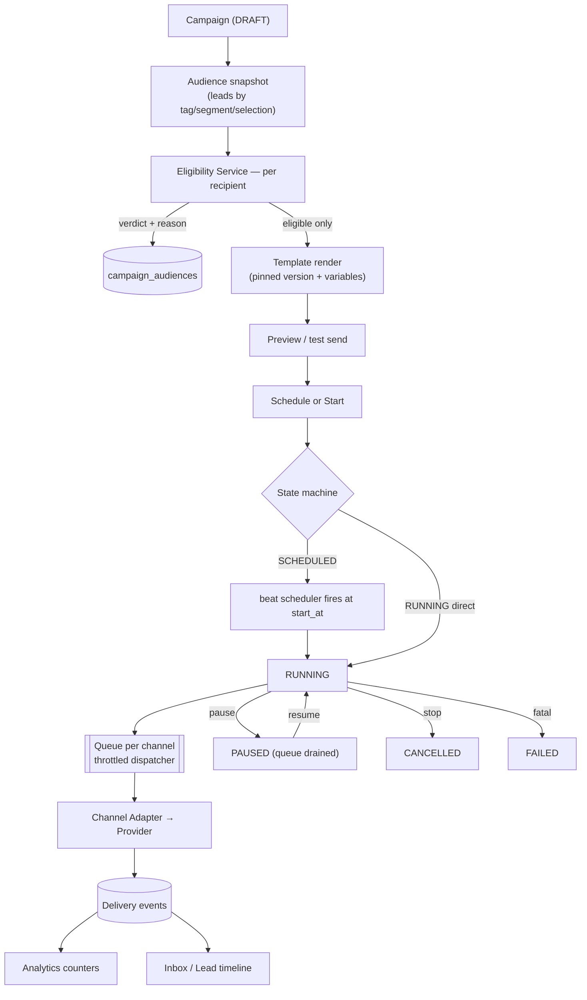
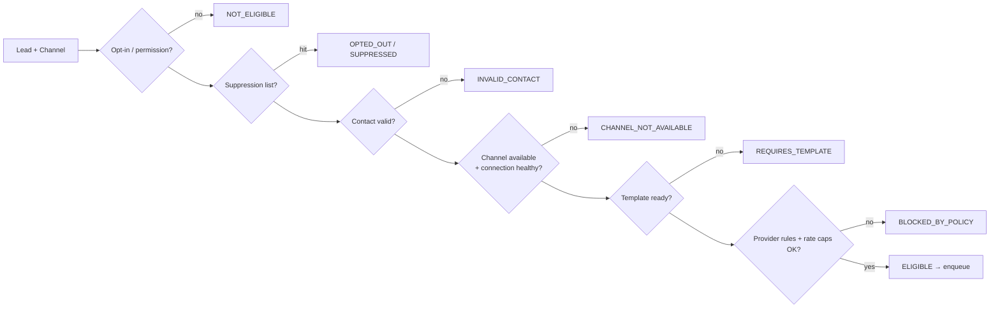

# 15 — Campaign Architecture & Eligibility Engine

> Covers required architecture doc: **Campaign Architecture** (Brief §18) ·
> **Communication Eligibility Service** (Brief §20) · Template System (Brief §19)

## 1. Campaign Engine Pipeline

The engine is independent from individual channels (doc 10):

## 2. Campaign States (Brief §18)

`DRAFT → SCHEDULED → RUNNING → PAUSED → COMPLETED / FAILED / CANCELLED`

Must-support controls: **Start · Pause · Resume · Stop · Schedule · Preview · Test
send · Progress · Logs · Analytics** — each is an API endpoint + audited action
(doc 04). Pause drains the queue within one poll interval; in-flight message outcomes
are still tracked to completion. Audience snapshot makes runs reproducible and reports
exact (skipped-reason → sent) accounting.

## 3. Communication Eligibility Service (central, reusable)

Every outbound message — campaign or inbox reply — passes this gate **before queueing**:

Statuses (exactly as specified): `ELIGIBLE, NOT_ELIGIBLE, OPTED_OUT, SUPPRESSED,
INVALID_CONTACT, CHANNEL_NOT_AVAILABLE, REQUIRES_TEMPLATE, BLOCKED_BY_POLICY` — each
verdict + reason is stored per recipient in `campaign_audiences`, making every skip
explainable in the UI and exportable for audit. The same service is reused by
WhatsApp, Email, and future SMS (Brief §20).

## 4. Central Template System (Brief §19)

| Aspect | Design |
|---|---|
| Variables | `{{first_name}} {{business_name}} {{city}} {{category}} {{website}}` + custom lead fields; validated against lead schema; missing values → fallback rules or skip |
| Record | channel, template name, version, variables, preview, validation, status, provider approval state (e.g., WhatsApp WABA approval) |
| Versioning | Campaigns pin a version — editing a template never mutates a running campaign |
| Rendering | One renderer for all channels; channel adapters may add format constraints (e.g., WhatsApp body limits, email HTML) — never duplicate variable logic |
| Preview | Server-side render against a sample or real lead + test-send to operator-owned address/number |

## 5. Progress, Logs, Analytics

- Counters per campaign: total recipients / eligible / skipped (by reason) / sent /
  delivered / failed / replies — computed from `campaign_audiences` +
  `message_events`, never hand-maintained.
- Live progress via SSE from dispatcher events (doc 05); campaign logs structured and
  correlated by `campaign_id` (doc 22).
- Campaign analytics view (`/campaigns/:id`) and aggregate analytics (`/analytics`)
  read the same event-based source of truth (doc 16) — no parallel bookkeeping.

## 6. Interruption Safety (Brief §39 "campaign interruption")

Audience snapshot + per-recipient state mean any crash/resume/restart continues from
the last unprocessed recipient; no duplicate sends (idempotent `message_id`); no lost
recipients (every row has a final verdict); restart-safe by design.
