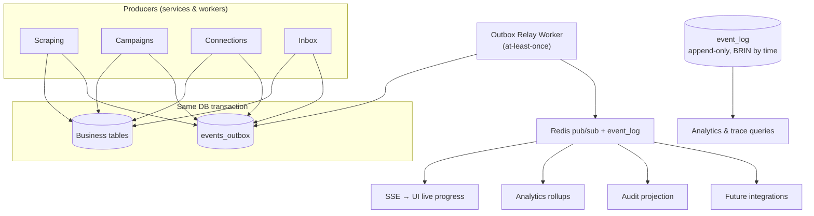

# 16 — Event Architecture

> Covers required architecture doc: **Event Architecture** · Diagram: **N (Event
> Architecture)** (Brief §22)

## 1. Design

QBIT uses an **internal, transactional event model**: services emit typed domain
events through a transactional **outbox** (row committed in the same DB transaction as
the business change), and a relay worker publishes them to in-process subscribers and
Redis pub/sub (for SSE). Events are traceable, append-only, and the single source for
analytics, dashboards, and the audit timeline.

## 2. Envelope

```json
{
  "event_id": "01J9ZK…",
  "type": "CAMPAIGN_MESSAGE_DELIVERED",
  "occurred_at": "2026-09-02T08:15:30Z",
  "actor": { "kind": "user|system|worker", "id": "…" },
  "correlation": { "request_id": "…", "job_id": "…", "campaign_id": "…",
                    "lead_id": "…", "message_id": "…", "connection_id": "…" },
  "payload": { … },
  "schema_version": 1
}
```

Rules: `event_id` ULID; `type` from the fixed catalog below; correlation ids always
propagated (Brief §31: Request ID → Job ID → Lead ID → Campaign ID → Message ID);
`schema_version` enables safe evolution; consumers are idempotent on `event_id`.

## 3. Event Catalog (Brief §22, plus operational extensions)

| Domain | Events |
|---|---|
| Scraping | `SCRAPE_JOB_CREATED` · `SCRAPE_JOB_STARTED` · `SCRAPE_JOB_COMPLETED` · `SCRAPE_JOB_FAILED` · `SCRAPE_JOB_PAUSED` · `SCRAPE_JOB_RESUMED` · `SCRAPE_JOB_CANCELLED` |
| Leads | `LEAD_CREATED` · `LEAD_UPDATED` · `LEAD_DEDUPLICATED` · `LEAD_MERGED` · `LEAD_TAGGED` · `LEAD_OPTED_OUT` · `LEAD_SUPPRESSED` |
| Campaigns | `CAMPAIGN_CREATED` · `CAMPAIGN_STARTED` · `CAMPAIGN_PAUSED` · `CAMPAIGN_RESUMED` · `CAMPAIGN_COMPLETED` · `CAMPAIGN_FAILED` · `CAMPAIGN_CANCELLED` |
| Messages | `MESSAGE_QUEUED` · `MESSAGE_SENT` · `MESSAGE_DELIVERED` · `MESSAGE_READ` · `MESSAGE_FAILED` · `MESSAGE_RECEIVED` · `MESSAGE_BOUNCED` · `MESSAGE_UNSUBSCRIBED` |
| Connections | `CONNECTION_CREATED` · `CONNECTION_CONNECTED` · `CONNECTION_FAILED` · `CONNECTION_DISCONNECTED` · `CONNECTION_DEGRADED` · `CONNECTION_REAUTH_REQUIRED` |
| Exports | `EXPORT_CREATED` · `EXPORT_COMPLETED` · `EXPORT_FAILED` · `EXPORT_DOWNLOADED` |
| System | `SYSTEM_HEALTH_WARNING` · `USER_LOGIN` · `USER_LOGIN_FAILED` · `SETTINGS_CHANGED` (all audited) |

## 4. Diagram N — Event Architecture



**Outbox pattern** guarantees: business change without event = impossible; event
without business change = impossible. Relay is at-least-once → consumers dedup by
`event_id`. `event_log` retention is configurable; `audit_logs` are never purged
automatically (doc 21).

## 5. Traceability Example (Brief §31)

```
request_id: r-8f2a  (operator clicked "Run")
 └─ job_id: scrape job 01J9…
     └─ lead_id: 01J8… (LEAD_CREATED, source=google_maps v1.4.2)
         └─ campaign_id: 01J7… (audience included the lead)
             └─ message_id: 01J6… (MESSAGE_QUEUED → SENT → DELIVERED → READ)
```

Every id is searchable in `/settings/security` audit viewer and in logs; an incident
can be reconstructed end-to-end from `event_log` alone.

## 6. Analytics Consumption (Brief §21)

| Consumer | Events consumed | Output |
|---|---|---|
| Scraping analytics | SCRAPE_JOB_*, LEAD_* | jobs, records found/saved, duplicates, errors, duration |
| WhatsApp analytics | MESSAGE_* (wa) | queued/sent/delivered/read/failed/replies |
| Email analytics | MESSAGE_* (email) | queued/sent/delivered/bounced/opened/clicked/unsubscribed/replied |
| Campaign analytics | CAMPAIGN_* + MESSAGE_* | recipients, eligible, skipped(+reason), sent, delivered, failed, replies |
| Dashboard | rollup tables | Today's scrapes, running jobs, messages sent, storage usage, system health |

Rollups are materialized by the analytics worker into summary tables — dashboards
never scan raw event tables (doc 23, scaling).
