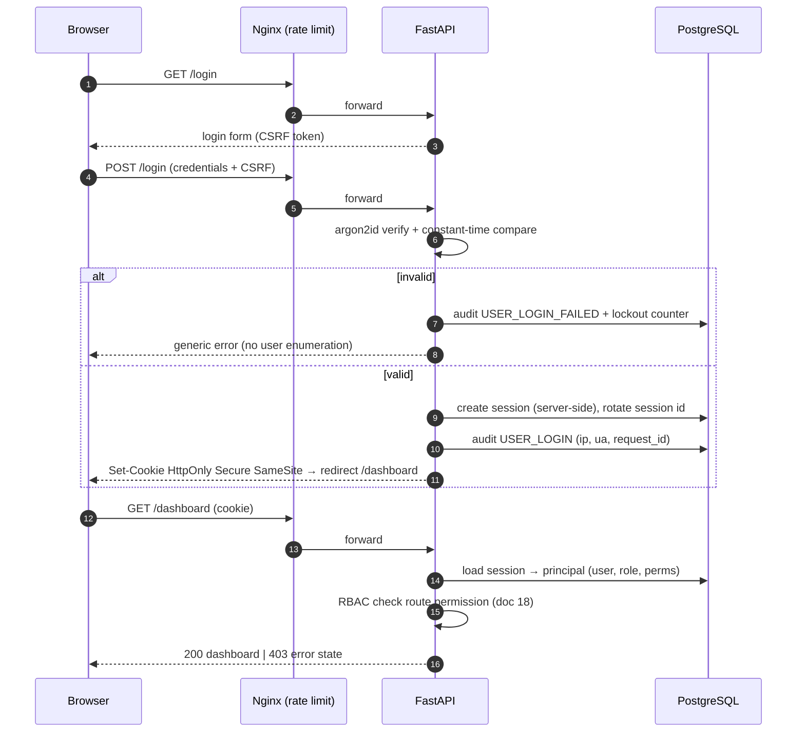

# 17 — Security Architecture & Authentication Flow

> Covers required architecture doc: **Security Architecture** · Diagram: **L
> (Authentication Flow)** (Brief §23, §41)

## 1. Security Baseline (production-grade admin authentication)

| Control | Implementation |
|---|---|
| Password hashing | **Argon2id** (memory-hard), per-user salt, tuned params; breach-resistant |
| Sessions | Server-side, HttpOnly + Secure + SameSite=Lax cookies, rotation on privilege change, absolute + idle TTL, server-side revocation list |
| CSRF | Per-session CSRF token on all state-changing forms/HTMX calls (double-submit cookie + header check) |
| Rate limiting | Nginx zone (per-IP) + app-level (per-account) on `/login` and webhook endpoints; progressive lockout with audit events |
| RBAC | Every route declares required permission; middleware enforces (doc 18) |
| Audit logs | Append-only `audit_logs`: who, what, when, ip, request_id, before/after for privileged actions (Brief §23) |
| Secure headers | HSTS, X-Content-Type-Options, X-Frame-Options DENY, CSP (self + vendored assets), Referrer-Policy, Permissions-Policy — set at Nginx + app |
| Input validation | Pydantic schemas at every boundary; strict types; file uploads type/size checked |
| Output sanitization | Jinja2 autoescape ON; user content never rendered as HTML; log injection guarded |
| Secret protection | Secrets server-side only (Brief §41) — env or vault; never in code, DB plaintext, logs, or API responses |
| Encryption | Fernet vault for provider credentials; TLS 1.2+ everywhere via Nginx |
| Webhook verification | HMAC signature validation (provider-specific) + timestamp window + replay dedup before processing |
| File access control | Downloads only through authorized, permission-checked streaming endpoints — no public static dirs (doc 07) |

## 2. Secrets Model (Brief §41 — never exposed to clients)

```
Environment / .env  →  QBIT_SECRET_KEY (sessions), QBIT_VAULT_KEY (Fernet master)
Provider credentials → encrypted ciphertext in DB; plaintext ONLY in worker memory
                      at send time; never logged, never in responses
Rotation            → vault key rotation re-encrypts all secrets (documented runbook)
```

The five roles get *least privilege* by default — not every user has unrestricted
access (Brief §23). Secrets are never sent to any frontend client, in any role.

## 3. Diagram L — Authentication Flow



Session hardening: idle timeout (default 60 min) + absolute timeout (12 h) +
reauthentication for destructive actions (`/settings/*`, disconnect, deletes).

## 4. Webhook Security

WhatsApp/email provider callbacks hit `/api/v1/webhooks/*`: HMAC signature verified
against the connection's stored verification secret; timestamp tolerance window;
`external_event_id` dedup before any processing; unverified traffic is dropped and
audited. Webhook endpoints are the only anonymous routes besides `/login` and health.

## 5. Operational Security

- Docker: non-root containers, read-only code mounts, capability drop, internal-only
  Postgres/Redis networks (doc 20).
- Dependency hygiene: pinned versions, `pip-audit` in CI.
- Backups encrypted at rest (doc 21); backup restores are tested.
- Log redaction middleware: known secret patterns (tokens, passwords, vault keys)
  never enter logs — enforced by structlog processor + tests.

## 6. Auditability (Brief rule 22)

Every privileged operation writes `audit_logs` with actor, action, target, request_id,
before/after. UI: `/settings/security` audit viewer with filters. Audit rows are
append-only — no update/delete path exists in the application.
