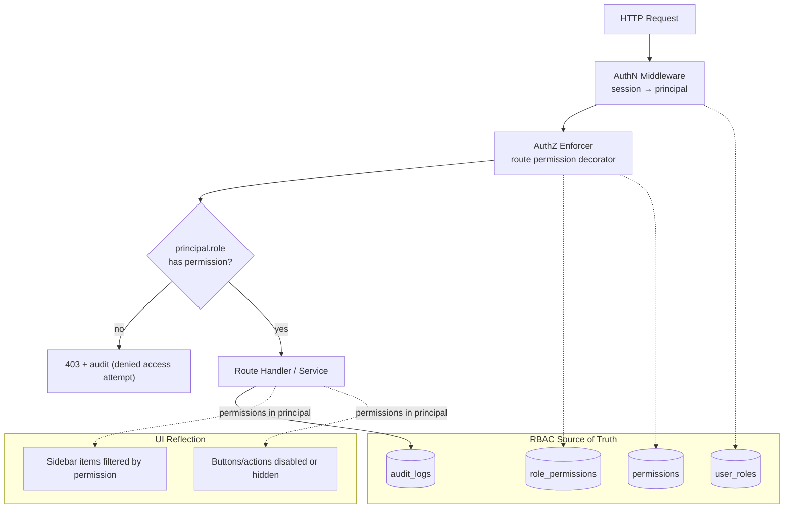

# 18 — RBAC Architecture

> Covers required architecture doc: **Authentication/RBAC Architecture** · Diagram:
> **M (RBAC Architecture)** (Brief §23)

## 1. Role Model

Five fixed, seeded roles (future-ready), least-privilege by default:

| Role | Intent |
|---|---|
| `SUPER_ADMIN` | Full control incl. system settings, users, security, storage, vault |
| `ADMIN` | Day-to-day platform administration (connections, users view, all modules) |
| `MANAGER` | Campaigns, templates, audiences, exports; approves spend-bearing actions |
| `OPERATOR` | Runs scrapers, manages leads, replies in inbox, exports |
| `VIEWER` | Read-only dashboards and analytics |

## 2. Permission Matrix (source of truth: `roles` × `permissions` tables)

| Permission | SUPER_ADMIN | ADMIN | MANAGER | OPERATOR | VIEWER |
|---|---|---|---|---|---|
| dashboard.view | ✔ | ✔ | ✔ | ✔ | ✔ |
| scraper.run / job.pause / job.cancel | ✔ | ✔ | ✔ | ✔ | — |
| leads.view | ✔ | ✔ | ✔ | ✔ | ✔ |
| leads.edit / leads.import / leads.merge | ✔ | ✔ | ✔ | ✔ | — |
| campaign.create / campaign.start | ✔ | ✔ | ✔ | — | — |
| campaign.pause / campaign.stop | ✔ | ✔ | ✔ | — | — |
| template.manage | ✔ | ✔ | ✔ | — | — |
| connection.manage | ✔ | ✔ | — | — | — |
| inbox.reply / inbox.assign | ✔ | ✔ | ✔ | ✔ | — |
| export.create / export.download | ✔ | ✔ | ✔ | ✔ | — |
| analytics.view | ✔ | ✔ | ✔ | ✔ | ✔ |
| settings.users.manage | ✔ | ✔ | — | — | — |
| settings.security.view | ✔ | ✔ | — | — | — |
| settings.system.manage / storage.manage | ✔ | — | — | — | — |
| audit.view | ✔ | ✔ | — | — | — |

Changes to the matrix are themselves audited (`SETTINGS_CHANGED`).

## 3. Diagram M — RBAC Architecture

## 4. Enforcement Mechanics

- **Declarative:** every router/route declares `require("campaign.start")` — no
  implicit access; CI test asserts every route has a permission.
- **Service-level defense-in-depth:** sensitive services re-check permissions (UI
  filtering is never the security boundary).
- **Scoping:** actions are audited with actor + request_id; destructive actions
  (disconnect, user management, system settings) additionally require re-
  authentication (step-up, doc 17).
- **No privilege ambiguity:** one active role per session v1 (multi-role assignment
  supported in schema for future needs).
- **Deny by default:** unknown route/permission → deny; missing permission → deny.

## 5. Administration UI

`/settings/users`: list users, assign roles, deactivate (never hard-delete — audit
continuity), force password reset. `/settings/security`: session list with revoke,
login history, denied-attempt log, audit viewer. All actions require `SUPER_ADMIN`/
`ADMIN` per the matrix and are fully audited.
