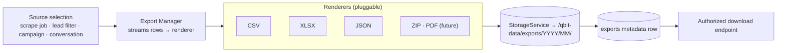

# 19 — File / Export Architecture

> Covers required architecture doc: **File/Export Architecture** (Brief §24) ·
> Optional external storage note (Brief §25)

## 1. Export System

- Generation is a **background job** on `q.export` — never inline in the HTTP request
  (Brief rule 25). Large exports stream in constant memory (row-batched writes).
- Formats shipped in v1: **CSV, XLSX, JSON** (Brief §24); ZIP/PDF are renderer
  additions later — no core change.
- A large-export guard (row/size threshold) triggers chunked multi-file output or
  operator confirmation (doc 23 "Large export", "Partial export").

## 2. Export Record (exactly per Brief §24)

| Field | Purpose |
|---|---|
| `export_id` | ULID, used in URLs |
| `filename` | Human-readable, deterministic (`leads_google_maps_2026-09-02.xlsx`) |
| `format` | csv / xlsx / json |
| `source` | job_id / campaign_id / filter snapshot |
| `record_count` | Exact rows written |
| `size` | Bytes on disk |
| `created_at` / `created_by` | Actor + time (audited) |
| `status` | QUEUED / RUNNING / COMPLETED / FAILED — visible on `/exports` |

## 3. File Management UX (`/exports`)

Users can: view files (metadata + source link), download (authorized streaming),
delete per permissions (soft, audited), see size, creation time, source/job, and
search/filter by name/source/format/date. Import files from `/leads/import` land in
`imports/` and are archived with their `files` rows.

## 4. Optional Google Drive / External Storage (Brief §25)

- Local/mounted storage remains the **primary and mandatory** store.
- A Drive connector is an **optional, admin-enabled push-only export target**:
  `QBIT Local Storage → Optional Export → Google Drive`.
- It is never a read path for the platform and never the system of record; removing it
  changes nothing else. Credentials via OAuth consent, stored in the vault.

## 5. Integrity & Housekeeping

- Every file checksummed (sha256) at write; nightly spot verification (doc 07).
- Downloads are logged (`EXPORT_DOWNLOADED` events) for audit.
- Nothing user-owned auto-deletes; only `temporary/` and `cache/` are auto-cleaned,
  and only their own contents (doc 07 §3).
