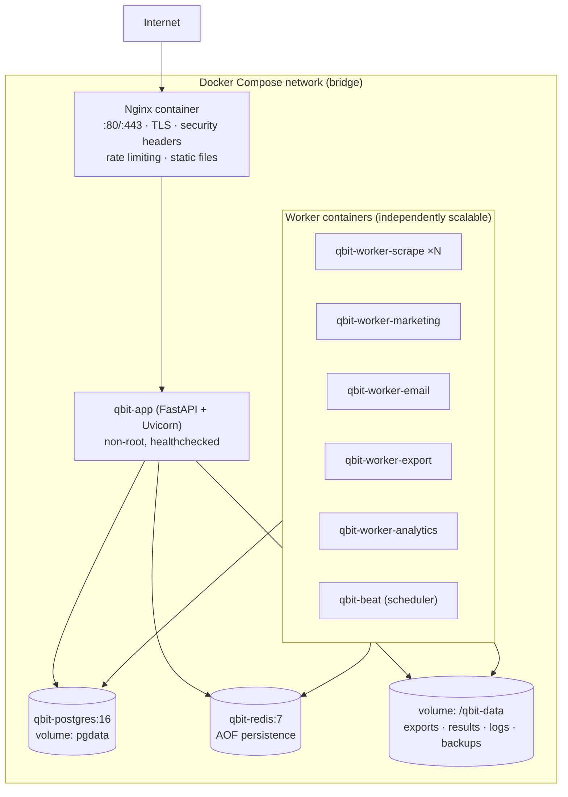

# 20 — Deployment Architecture

> Covers required architecture doc: **Deployment Architecture** · Diagram: **K
> (Deployment Architecture)** (Brief §26, §27)

## 1. Target: Self-Hosted Linux + Docker Compose

- **Postgres/Redis are internal-only** (no published ports); only Nginx is exposed.
- App and workers are the same image, different commands — one build, many roles.
- Workers scale with `docker compose up --scale qbit-worker-scrape=4`.
- `restart: unless-stopped` everywhere; healthchecks gate dependency startup.

## 2. Environment Variables (deployment-critical subset)

| Variable | Purpose |
|---|---|
| `QBIT_ENV=production` | Enables secure cookies, header hardening |
| `QBIT_BASE_URL` | Canonical URL (webhook construction) |
| `QBIT_SECRET_KEY` / `QBIT_VAULT_KEY` | Session signing / credential vault master key |
| `QBIT_DB_URL` | Postgres DSN |
| `QBIT_REDIS_URL` | Broker + pub/sub |
| `QBIT_DATA_DIR=/qbit-data` | Storage root (bind mount) |
| `QBIT_LOG_LEVEL` / `QBIT_LOG_FORMAT=json` | Observability |

## 3. Upgrade & Rollback Strategy

1. `docker compose pull` / build new image tag (never `latest` in prod).
2. Backup (doc 21) → apply Alembic migrations (forward-only) → rolling restart app →
   restart workers.
3. Rollback = previous image tag; schema rollbacks are **not automatic** (forward-only
   policy) — a rollback plan is part of every migration review.
4. Release checklist in CI: tests green, migrations linted, image scanned.

## 4. Non-Docker Fallback (systemd)

For hosts without Docker: system units `qbit.service` (uvicorn), 
`qbit-worker-scrape@.service` (templated), `qbit-beat.service`, native 
`postgresql`/`redis` packages, Nginx site config. Same env contract; documented in the
runbook when implementation reaches Phase 14.

## 5. Resource Sizing (baseline VPS)

| Profile | vCPU/RAM | Layout |
|---|---|---|
| Starter (≤10k leads) | 2 vCPU / 4 GB | 1× app, 1× scrape worker, 1× combined worker, PG, Redis |
| Standard (≤100k leads) | 4 vCPU / 8 GB | 2× app, 2–4× scrape workers, dedicated marketing/email workers |
| Performance (1M+ leads) | 8+ vCPU / 16+ GB | scaled workers, dedicated PG tuning, partitioned tables (doc 23) |

## 6. First-Run Bootstrapping

`compose up` → migrations run → seed script creates: five roles + permission matrix,
first SUPER_ADMIN (password set from env on first login, then forced change),
`system_settings` defaults, storage directories, and the scraper registry scan. No
license key, activation server, or cloud login ever participates in bootstrap
(Brief §34).
